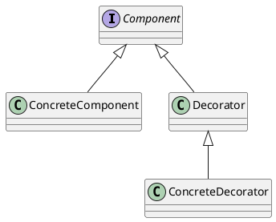

# 装饰器模式

## 类图


interface Component
class ConcreteComponent
class Decorator
class ConcreteDecorator

Component <|-- ConcreteComponent
Component <|-- Decorator
Decorator <|-- ConcreteDecorator


*plantuml*

各角色描述如下：

+ Component： 抽象组件角色，定义一组抽象的接口，规定这个被装饰组件都有哪些功能
+ ConcreteComponent： 实现这个抽象组件的所有功能
+ Decorator： 装饰器角色，它持有一个Component对象实例的引用，定义一个与抽象组件一致的接口
+ ConcreteDecorator： 具体的装饰器实现者，负责实现装饰器角色定义的功能
