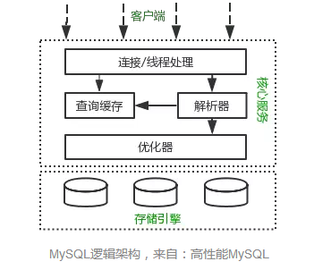

## MySQL 基础

### MySQL 逻辑架构



MySQL的逻辑架构如上图所示，共包含三层：

+ 第一层：客户端层，用于连接处理、授权认证、安全等
+ 第二层：解析层，包括查询解析、分析、优化、缓存以及所有的内置函数
+ 第三层：存储引擎，服务器通过API与其通信，API规避了不同存储引擎的差异，不同存储引擎也不会互相通信

### 事务

事务（Transaction）是MySQL中并发控制的基本单位。事务是一组原子的SQL操作序列，这些操作要么都执行，要么都不执行，是一个不可分割的工作单位。

事务的四大基本特征：

+ 原子性(atomicity)： 一个事务必须被视为一个不可分割的最小工作单元，整个事务的所有操作要么全部提交成功，要么全部失败回滚
+ 一致性(consistency)：数据库总是从一个一致性状态转换到另一个一致性的状态。
+ 隔离性(isolation): 事务允许多个用户对同一个数据进行并发访问，而不破坏数据的正确性和完整性。同时，并行事务的修改必须与其他并行事务的修改相互独立。
+ 持久性(durability): 一旦事务提交，则其所做的修改将会永远保存在数据库中

### 隔离级别

隔离级别规定了一个事务中所做的修改，哪些在事务内和事务间是可见的，哪些是不可见的。较低级别的隔离通常可以执行更高的并发，系统的开销也更低。共有四种隔离级别：

+ READ UNCOMMITTED (未提交读): 事务中的修改，即使没有提交，对其他事务也都是可见的。可能会有脏读。
+ READ COMMITTED (提交读): 一个事务从开始直到提交之前，所做的任何修改，其他事务是不可见的。
+ REPEATABLE READ (可重复读): 在同一个事务内的查询都是事务开始时刻一致的，InnoDB默认级别。
+ SERIALIZABLE (串行读): 完全串行化的读，每次读都需要获得表级共享锁，读写相互都会阻塞

### MySQL中的锁

为实现事务的原子性和一致性，会使用加锁的方式来实现

MySQL中的锁按粒度区分：

+ 表锁，最基本的锁策略，并且是开销最小的策略。会锁住整张表，导致并发能力下降，一般是DDL处理时使用，区分读锁和写锁
+ 行锁，只锁住有限地数据，最大程度地支持并发处理(同时也带来了最大地锁开销)，一般用于处理并发事务

根据不同的业务场景，可以选用不同的并发控制方式： 乐观并发控制 vs 悲观并发控制

#### 悲观锁

> 悲观并发控制(Pessimistic Concurrency Control, PCC), 指的是对数据被外界（包括本系统当前的其他事务，以及来自外部系统的事务处理）修改持保守态度(悲观)。

在数据库中，悲观锁的流程：

1. 对任意记录修改前，先尝试为该记录加上排他锁
2. 如果加锁失败，说明该记录正在被修改，那么当前查询可能要等待或者抛出异常
3. 如果成功加锁，那么就可以对记录做修改，事务完成后就会解锁了
4. 其间如果有其他对该记录做修改或者加排他锁的操作，都会等待或者直接抛出异常

#### 乐观锁

> 乐观并发控制（Optimistic Concurrency Control，OCC）, 假设多用户并发的事务在处理时不会彼此互相影响，各事务能够在不产生锁的情况下处理各自影响的那部分数据。在提交数据更新之前，每个事务会先检查在该事务读取数据后，有没有其他事务又修改了该数据。如果其他事务有更新的话，正在提交的事务会进行回滚

乐观锁假设认为数据一般情况下不会造成冲突，所以在数据进行提交更新的时候，才会正式对数据的冲突与否进行检测，如果发现冲突了，则让返回用户错误的信息，让用户决定如何去做。

### 多版本并发控制

MySQL的大多数事务型存储引擎实现的都不是简单的行级锁。基于提升并发性能的考虑，一般都同时实现了多版本的并发控制(MVCC)。

InnoDB的MVCC，是通过在每行记录后面保存两个隐藏的列来实现的。这两个列，一个保存了行的创建时间，一个保存行的过期时间(或删除时间)。在实际操作中，存储的并不是时间，而是事务的版本号，每开始一个新的事务，系统版本号都会自动递增。

+ SELECT: 读取 创建版本号 <= 当前事务版本号，删除版本号为空 或 > 当前事务版本号
+ INSERT: 保存当前事务版本号为行的创建版本号
+ DELETE: 保存当前事务版本号为行的删除版本号
+ UPDATE: 插入一条新的记录，保存当前事务版本号为行创建版本号，同时保存当前事务版本号到原来删除的行

### 索引

索引是存储引擎用于快速找到记录的一种数据结构。索引是存储引擎层面实现的，不是server层面，不是所有的存储引擎都支持所有的索引类型。在MySQL中，索引按照不同角度来看，有如下的分类方式：

__按数据结构角度__

+ B+树索引，最常见的索引
+ Hash索引，基于Hash表，只支持精确查找('=', 'IN', '<>')，不支持范围，不支持排序
+ 全文索引(FULLTEXT)，主要用来查找文本中的关键字，而不是直接与索引中的值相比较，配合MATCH AGAINST使用
+ R-Tree索引，不常用

__按物理存储角度__

+ 聚集索引(clustered index)
+ 非聚集索引(non-clustered index)

__按逻辑角度__

+ 主键索引，主键索引是一种特殊的唯一索引，不允许有空值
+ 普通索引(单列索引)
+ 多列索引(符合索引)，指多个字段上创建的索引，使用复合索引时遵循最左前缀集合
+ 唯一索引或非唯一索引
+ 空间索引

创建索引的语法：

```SQL
CREATE TABLE table_name[col_name data type]
[unique|fulltext|spatial][index|key][index_name](col_name[length])[asc|desc]
```

1. unique|fulltext|spatial为可选参数，分别表示唯一索引、全文索引和空间索引；
2. index和key为同义词，两者作用相同，用来指定创建索引
3. col_name为需要创建索引的字段列，该列必须从数据表中该定义的多个列中选择；
4. index_name指定索引的名称，为可选参数，如果不指定，MYSQL默认col_name为索引值；
5. length为可选参数，表示索引的长度，只有字符串类型的字段才能指定索引长度；
6. asc或desc指定升序或降序的索引值存储

## 参考资料

+ [《高性能MySQL(第3版)》 - 施瓦茨 (Baron Schwartz)](https://www.amazon.cn/dp/B00C1W58DE/ref=pd_cp_14_1?_encoding=UTF8&psc=1&refRID=EYMHA4NXBBPTXZS81NMY)