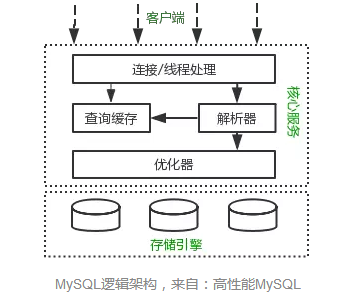

## MySQL 基础

### MySQL 逻辑架构

MySQL的逻辑架构如上图所示，共包含三层：

+ 第一层：客户端层，用于连接处理、授权认证、安全等
+ 第二层：解析层，包括查询解析、分析、优化、缓存以及所有的内置函数
+ 第三层：存储引擎，服务器通过API与其通信，API规避了不同存储引擎的差异，不同存储引擎也不会互相通信

### 事务

事务（Transaction）是MySQL中并发控制的基本单位。事务是一组原子的SQL操作序列，这些操作要么都执行，要么都不执行，是一个不可分割的工作单位。

事务的四大基本特征：

+ 原子性(atomicity)： 一个事务必须被视为一个不可分割的最小工作单元，整个事务的所有操作要么全部提交成功，要么全部失败回滚
+ 一致性(consistency)：数据库总是从一个一致性状态转换到另一个一致性的状态。
+ 隔离性(isolation): 事务允许多个用户对同一个数据进行并发访问，而不破坏数据的正确性和完整性。同时，并行事务的修改必须与其他并行事务的修改相互独立。
+ 持久性(durability): 一旦事务提交，则其所做的修改将会永远保存在数据库中

### 隔离级别

隔离级别规定了一个事务中所做的修改，哪些在事务内和事务间是可见的，哪些是不可见的。较低级别的隔离通常可以执行更高的并发，系统的开销也更低。共有四种隔离级别：

+ READ UNCOMMITTED (未提交读): 事务中的修改，即使没有提交，对其他事务也都是可见的。可能会有脏读。
+ READ COMMITTED (提交读): 一个事务从开始直到提交之前，所做的任何修改，其他事务是不可见的。
+ REPEATABLE READ (可重复读): 在同一个事务内的查询都是事务开始时刻一致的，InnoDB默认级别。
+ SERIALIZABLE (串行读): 完全串行化的读，每次读都需要获得表级共享锁，读写相互都会阻塞

### MySQL中的锁

为实现事务的原子性和一致性，会使用加锁的方式来实现

MySQL中的锁按粒度区分：

+ 表锁，最基本的锁策略，并且是开销最小的策略。会锁住整张表，导致并发能力下降，一般是DDL处理时使用，区分读锁和写锁
+ 行锁，只锁住有限地数据，最大程度地支持并发处理(同时也带来了最大地锁开销)，一般用于处理并发事务