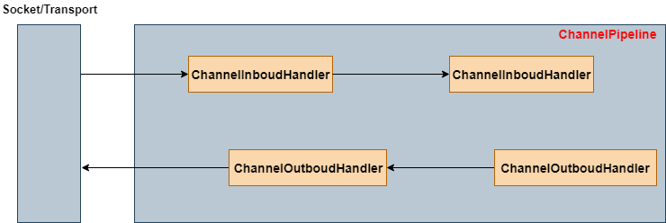

# Netty 简介

## 特性

+ 设计优雅： 统一的API，支持多种传输类型，阻塞和非阻塞的；简单强大的线程模型
+ 高性能：拥有比Java核心API更高的吞吐量和更低的延迟；得益于池化和复用，拥有更低的资源消耗；最少的内存复制

## Netty 组件和设计

### Channel、EventLoop、ChannelFuture

#### Channel 接口

基本的I/O操作（`bind()`,`connect()`,`read()` 和 `write()`）依赖于底层网络传输所提供的原语。Netty的Channel接口所提供的API，大大降低了直接使用Socket类的复杂性。

#### EventLoop 接口

EventLoop 定义了Netty的核心抽象，用于处理连接的生命周期中所发生的事件。

EventLoop 和 Channel等之间的关系：

+ 一个EventLoopGroup 包含一个或者多个 EventLoop
+ 一个 EventLoop 在它的生命周期中只和一个 Thread 绑定
+ 所有由 EventLoop 处理的I/O事件都得在它专有得 Thread 上被处理
+ 一个 Channel 在它的生命周期内只注册于一个 EventLoop
+ 一个 EventLoop 可能会被分配给一个或多个 Channel

#### ChannelFuture 接口

Netty 中所有的I/O操作都是异步的，一个操作可能不会立即返回。Netty 提供了 ChannelFuture 接口，其 `addListener()` 方法注册了一个 ChannelFutureListener，以便在某个操作完成时(无论是否成功)得到通知

### ChannelHandler 和 ChannelPipeline

#### ChannelHandler 接口

从应用程序开发人员的角度看，Netty的主要组件是 ChannelHandler，它充当了所有处理入站和出站数据的应用程序逻辑的容器。

#### ChannelPipeline 接口

ChannelPipeline 提供了 ChannelHandler 链的容器，并定义了用于在该链上传播入站和出站事件流的API。当 Channel 被创建的时候，它会被自动地分配到它专属的 ChannelPipeline。

### 编码器和解码器

当通过Netty发送或者接收一个消息的时候，将会发生一次数据转换。入站消息会被解码，也就是说，从字节转换为另一种格式，通常是一个Java对象。如果是出战消息，它将从它的当前格式被编码为字节

## 引导

Netty的引导类为应用程序的网络层配置了容器，者涉及到将一个进程绑定到某个指定的端口，或者将一个进程连接到另一个运行在某个指定主机的指定端口上的进程

两种引导：

+ 客户端引导： Bootstrap，用于连接到远程主机和端口
+ 服务端引导： ServerBootstrap， 用于绑定一个本地端口