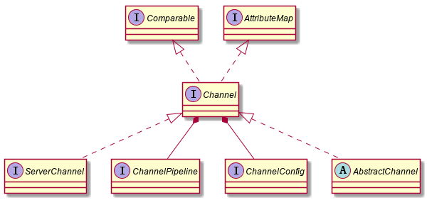

# 传输

## 传输API

传输API的核心是Channel接口，它被用于所有的I/O操作

每个Channel都会被分配一个 ChannelPipeline 和 ChannelConfig。ChannelConfig 包含了该 Channel 的所有配置，并且支持热更新。

Netty 的 Channel 实现是线程安全的，可以存储一个到Channel的引用，当需要向远程节点写数据的时候，都可以使用它。

## 内置的传输

Netty 内置了一些可开箱即用的传输：

+ NIO： 使用 java.nio.channels 包作为基础，基于选择器的方式
+ Epoll： 由JNI驱动的`epoll()` 和非阻塞IO （Linux系统可用）
+ OIO： 使用 java.net 包作为基础，阻塞IO
+ Local： 可以在VM内部通过管道进行通信的本地传输
+ Embeded： 允许使用 ChannelHandler 而又不需要一个真正的基于网络的传输，多用于测试ChannelHandler