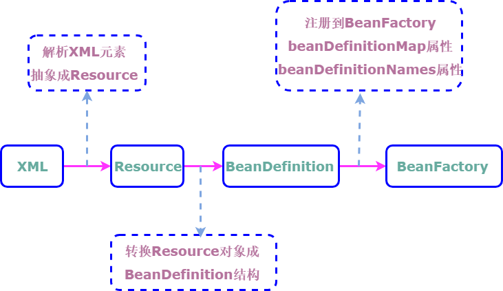
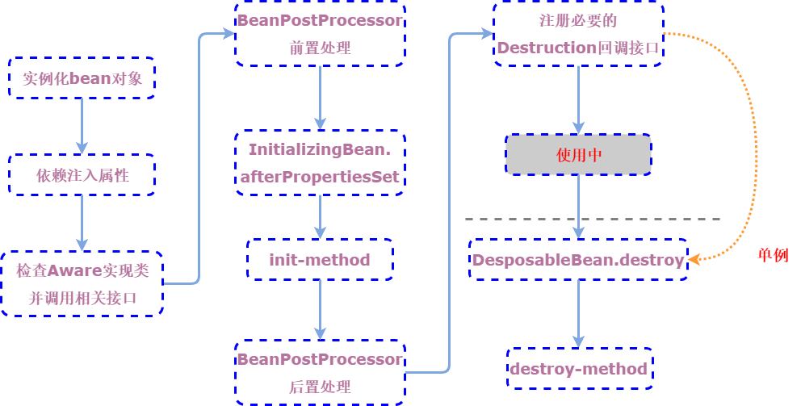

# Spring 基础

## IoC

控制反转： IoC是一种设计思想，控制反转，转移的是创建对象的主动权，即针对一个组件的依赖部分从自己new转移到外部容器来装配和管理。实现控制反转的手段是依赖注入(DI)。

### IoC容器初始化流程

## Bean

### Java Bean 规范

Bean 是用于Java的可重用软件组件的惯用叫法。

Java Bean 规范大概内容：

1. 有一个public无参构造器
2. 属性可以通过get，set，is(可以替代get用于bool属性上)方法进行访问
3. 可序列化

### Bean 生命周期

### BeanFactory

BeanFactory 子类：

+ ListableBeanFactory: 表示Bean工厂是可列表的
+ HierarchicalBeanFactory： 表示Bean工厂是有继承关系的
+ AutowireCapableBeanFactory： 表示Bean工厂是可自动装配的

扩展不同的子类是为了区分在Spring内部对象的传递和转化的过程中，对对象的数据访问所做的限制。最终的默认实现是 `DefaultListableBeanFactory`。

### ApplicationContext

ApplicationContext 子类：

+ ConfigurableApplicationContext: 表示Context是可配置的
+ WebApplicationContext: 为Web准备的Context，可以直接访问到ServletContext

总的来说，ApplicationContext 必须完成以下几件事情：

+ 标识一个应用环境
+ 利用BeanFactory创建对象
+ 保存对象关系表
+ 能够捕获各种事件