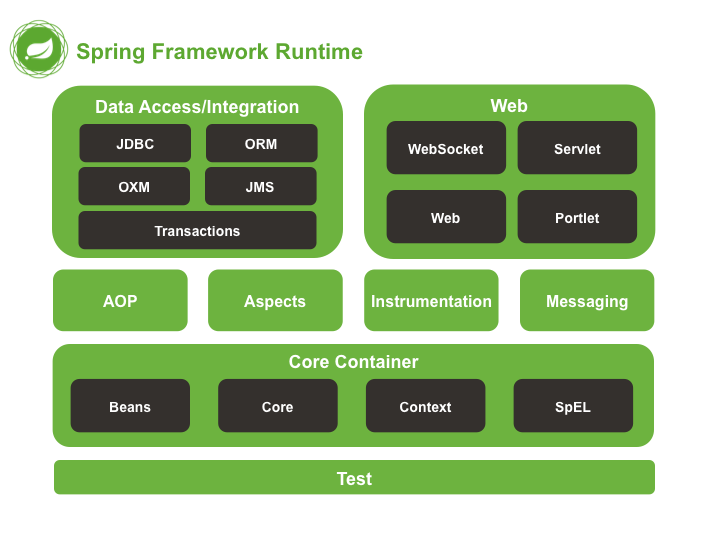

# Spring 基础知识

### Spring 解释

Spring是一个开源框架，用于简化Java企业级应用开发。提供了依赖注入，事务管理，Web应用，数据访问，消息以及测试等功能。

### Spring用于简化Java开发的关键策略

+ 基于POJO的轻量级和最小侵入性编程
+ 通过依赖注入和面向接口实现松耦合
+ 基于切面和惯例进行声明式编程
+ 通过切面和模板减少样板式代码

### Spring模块

### 控制反转

是对组件对象控制权的转移，从程序代码本身转移到了外部容器，通过容器来实现对象组件的装配和管理。所依赖的对象不再自己new，而是在运行期间由容器根据配置文件描述将依赖关系注入到组件中。
