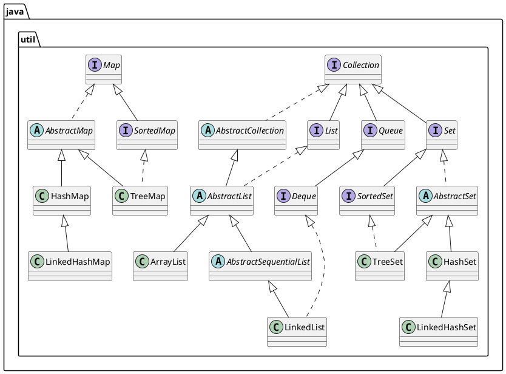

# Java集合框架

Java类库为保存对象提供一系列容器，也称为集合框架。Java集合包位于`java.util`包下，包含了很多常用的数据结构，如数组、链表、栈、队列、集合、哈希表等。

一般来讲，Java的集合框架主要包括三个部分：

+ `Collection`
+ `Map`
+ 工具类

`Collection` 接口是 `List`、`Set` 和 `Queue` 接口的父接口，抽象出了对"一堆对象"的公有操作。 `List` 通常表示一个列表，其中的元素允许重复。 `Set` 通常表示一个集合，接近数学中的"集合"概念，其中的元素不允许重复。`Queue` 通常表示一个队列，是一种特殊的线性表，它只允许在表的前端进行删除操作，而在表的后端进行插入操作。

`Map` 用于保存具有映射关系的数据。在Map中键可以是任意类型的对象，但不能有重复的键。

工具类主要包括用于遍历集合的迭代器，以及操作数组的Arrays和操作集合的Collections。

__概览图__


@startuml java-collections-framework

' author: tomoya deng

package java.util {
    interface Collection
    abstract class AbstractCollection

    ' List family
    interface List
    abstract class AbstractList
    class ArrayList
    abstract class AbstractSequentialList
    class LinkedList

    Collection <|-- List
    Collection <|.. AbstractCollection
    AbstractCollection <|-- AbstractList
    List <|.. AbstractList
    AbstractList <|-- ArrayList
    AbstractList <|-- AbstractSequentialList
    AbstractSequentialList <|-- LinkedList

    ' Queue family
    interface Queue
    interface Deque
    Collection <|-- Queue
    Queue <|-- Deque
    Deque <|.. LinkedList


    ' Set family
    interface Set
    interface SortedSet
    abstract class AbstractSet
    class TreeSet
    class HashSet
    class LinkedHashSet

    Collection <|-- Set
    Set <|-- SortedSet
    Set <|.. AbstractSet
    AbstractSet <|-- TreeSet
    AbstractSet <|-- HashSet
    SortedSet <|.. TreeSet
    HashSet <|-- LinkedHashSet


    ' Map family
    interface Map
    abstract class AbstractMap
    interface SortedMap
    class HashMap
    class TreeMap
    class LinkedHashMap

    Map <|.. AbstractMap
    Map <|-- SortedMap
    AbstractMap <|-- HashMap
    AbstractMap <|-- TreeMap
    SortedMap <|.. TreeMap
    HashMap <|-- LinkedHashMap
}
@enduml


*plantuml*




## Collection

Collection代表的是单个元素对象的序列，（可以有序/无序，可重复/不可重复等，具体依据具体的子接口Set，List，Queue等）。

### 继承关系

Collection 是collection容器继承关系中的根接口。接口定义:

```java
public interface Collection<E> extends Iterable<E> {}
```

Collection继承的Iterable是定义的一个遍历操作接口，采用hasNext next的方式进行遍历。Iterable定义了iterator()方法产生一个迭代器，具体实现还是放在具体类中去实现。

### API

#### 基础API

Collection接口抽象出了对"一堆对象"的公有操作，定义了下面这些重要的接口方法：

|  返回类型   |             方法签名              |                    描述                    |
| :---------- | :-------------------------------- | :----------------------------------------: |
| boolean     | add(E e)                          |                添加单个元素                |
| boolean     | addAll(Collection<? extends E> c) |      添加另一个Collection中的所有元素      |
| void        | clear()                           |                  清空容器                  |
| boolean     | contains(Object o)                |          判断容器是否包含某个元素          |
| boolean     | containsAll(Collection<?> c)      |   判断是否包含另一个Collection的所有元素   |
| boolean     | isEmpty()                         |              判断容器是否为空              |
| boolean     | remove(Object o)                  |           移除元素，成功返回true           |
| boolean     | remove(Object o)                  | 移除当前容器中包含在另一个容器中的所有元素 |
| boolean     | retainAll(Collection<?> c)        |            只保留两个容器的交集            |
| int         | size()                            |               容器中元素个数               |
| Object[]    | toArray()                         |              转换为Object数组              |
| T[]         | toArray(T[] a)                    |               转换为泛型数组               |
| Iterator<E> | iterator()                        |       返回迭代器，继承于Iterable接口       |

#### JDK8后新增接口方法

先看下Collection接口父接口Iterable接口新增的两个方法： spliterator和forEach

spliterator和forEach方法均为Iterable接口在JDK8新增的Default方法。Default方法是指，在接口内部包含了一些默认的方法实现（也就是接口中可以包含方法体，这打破了Java之前版本对接口的语法限制）。

```java
default void forEach(Consumer<? super T> action) {
    Objects.requireNonNull(action);
    for (T t : this) {
        action.accept(t);
    }
}

default Spliterator<T> spliterator() {
    return Spliterators.spliteratorUnknownSize(iterator(), 0);
}
```

spliterator和forEach方法主要是为Java的Stream操作提供支持。

spliterator方法返回一个Spliterator(splitable iterator可分割迭代器)，是Java为了并行遍历数据源中的元素而设计的迭代器。

forEach方法是一个被动迭代器方法，接受一个lambda表达式作为参数，来提供函数式编程的能力，从上面的默认接口方法定义中，可以看出，forEach方法内部实际上是由Java5新增的foreach语法实现的。

接下来看Collection接口中新增的方法：

```java
default boolean removeIf(Predicate<? super E> filter) {
    Objects.requireNonNull(filter);
    boolean removed = false;
    final Iterator<E> each = iterator();
    while (each.hasNext()) {
        if (filter.test(each.next())) {
            each.remove();
            removed = true;
        }
    }
    return removed;
}

default Stream<E> stream() {
    return StreamSupport.stream(spliterator(), false);
}

default Stream<E> parallelStream() {
    return StreamSupport.stream(spliterator(), true);
}
```

removeIf方法接受一个Predicate接口的lambda表达式，当测试条件返回为true时才执行删除操作。

stream方法返回一个串行流；parallelStream方法返回一个并行流。关于JDK8新增的Stream(流)详细介绍，参看扩展阅读。

## 扩展阅读

+ [Java 8 新特性概述](https://www.ibm.com/developerworks/cn/java/j-lo-jdk8newfeature/index.html)

+ [Java 8 中的 Streams API 详解](https://www.ibm.com/developerworks/cn/java/j-lo-java8streamapi/)
