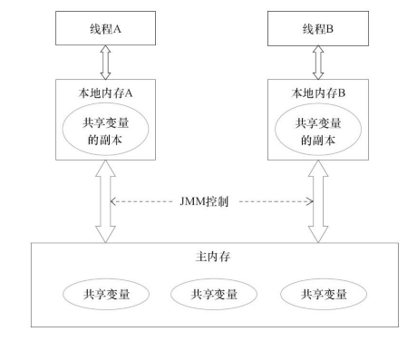

# Java内存模型

## 定义

Java内存模型（Java Memory Model, JMM）是一种Java虚拟机规范，用于屏蔽掉各种硬件和操作系统的内存访问差异，以实现让Java程序在各种平台下都能达到一致的并发效果。

从抽象的角度来看，JMM定义了线程和主内存之间的抽象关系：

+ 线程之间的共享变量存储在主内存（Main Memory）中
+ 每个线程都有一个私有的本地内存（Local Memory），本地内存中存储了该线程已读/写共享变量的拷贝副本。本地内存是JMM的一个抽象概念，并不真实存在，它涵盖了缓存、写缓冲区、寄存器以及其他的硬件和编译器优化。

JMM属于语言级的内存模型，它确保在不同的编译器和不同的处理器平台之上，通过禁止特定类型的编译器重排序和处理器重排序，为程序员提供一致的内存可见性保证。

## 重排序

程序执行时，为了提高性能，编译器和处理器常常会对指令做重排序。重排序分为三种类型：

+ 编译器优化的重排序。编译器在不改变单线程程序语义的前提下，可以重新安排语句的执行顺序。（锁粗化？）

+ 指令集并行的重排序。现代微处理器都会采用将指令乱序执行（out-of-order execution，简称OoOE或OOE）的方法，在条件允许的情况下，直接运行当前有能力立即执行的后续指令，避开获取下一条指令所需数据时造成的等待。

+ 内存系统的重排序。由于处理器使用缓存和读/写缓冲区，这使得加载和存储操作看上去可能是在乱序执行。

### 数据依赖性

如果两个操作访问同一个变量，且这两个操作中有一个为写操作，此时这两个操作之间就存在数据依赖性。编译器和处理器在重排序时，会遵守单线程数据依赖性，不会改变存在数据依赖关系的两个操作的执行顺序。

### as-if-serial语义

As-if-serial语义的意思是，所有的动作(Action)都可以为了优化而被重排序，但是必须保证它们重排序后的结果和程序代码本身的应有结果是一致的。Java编译器、运行时和处理器都会保证单线程下的as-if-serial语义。

### 重排序对多线程的影响

不同处理器之间和不同线程之间的数据依赖性不被编译器和处理器考虑，重排序不会影响单线程环境的执行结果，但是会破坏多线程的执行语义。

## happens-before

在正确同步的程序中不存在数据竞争，并会表现出串行一致性，意味着程序中所有的操作都会按照一种固定的和全局的顺序执行。而决定这些操作顺序的就是JMM的Happens-before规则。

Java内存模型是通过各种操作来定义的，包括对变量的读/写操作，监视器的加锁和释放操作，以及线程的启动和合并操作。JMM为程序中所有的操作定义了一个偏序关系，称之为Happens-before。

>
    在JMM中，如果一个操作执行的结果需要对另一个操作可见，那么这两个操作之间必须存在happens-before关系。

Happens-before的前后两个操作不会被重排序且后者对前者的内存可见。Happens-before规则包括：

+ 程序次序规则： 线程中的每个动作A都happens-before于该线程中的每一个动作B，其中，在程序中，所有的动作B都能出现在A之后。
+ 监视器锁规则： 对一个监视器锁的解锁 happens-before于每一个后续对同一监视器锁的加锁。
+ volatile规则： 对volatile域的写入操作happens-before于每一个后续对同一个域的读写操作。
+ 线程启动规则： 在一个线程里，对Thread.start的调用会happens-before于每个启动线程的动作。
+ 线程终结法则：线程中的任何动作都happens-before于其他线程检测到这个线程已经终结、或者从Thread.join调用中成功返回，或Thread.isAlive返回false。
+ 中断法则：一个线程调用另一个线程的interrupt happens-before于被中断的线程发现中断。
+ 终结法则：一个对象的构造函数的结束happens-before于这个对象finalizer的开始。
+ 传递性：如果A happens-before于B，且B happens-before于C，则A happens-before于C

上面八条是原生Java满足Happens-before关系的规则，但是我们可以对他们进行推导出其他满足happens-before的规则:

+ 将一个元素放入一个线程安全容器的操作Happens-Before从容器中取出这个元素的操作
+ 在CountDownLatch上的倒数操作Happens-Before CountDownLatch#await()操作
+ 释放Semaphore许可的操作Happens-Before获得许可操作
+ Future表示的任务的所有操作Happens-Before Future#get()操作
+ 向Executor提交一个Runnable或Callable的操作Happens-Before任务开始执行操作
+ 一个线程到达CyclicBarrier或Exchanger的操作将在其他到达该栅栏或交换点的线程被释放之前执行。

Java内存模型关于重排序规定的总结：

|是否允许重排序|第二项操作|||
|---|---|---|---|
|第一项操作|普通读 普通写|volatile读 同步块入口|volatile写 同步块出口|
|普通读 普通写|||不允许|
|volatile读 同步块入口|不允许|不允许|不允许|
|volatile写 同步块出口||不允许|不允许|

## 参考资料

+ [Java内存访问重排序的研究](https://tech.meituan.com/java-memory-reordering.html)
+ [《Java并发编程的艺术》方腾飞,魏鹏,程晓明 著. ](https://www.amazon.cn/dp/B012NDCEA0/ref=sr_1_1?ie=UTF8&qid=1520002234&sr=8-1&keywords=Java%E5%B9%B6%E5%8F%91%E7%BC%96%E7%A8%8B%E7%9A%84%E8%89%BA%E6%9C%AF)
+ [《深入理解Java虚拟机:JVM高级特性与最佳实践(第2版)》，周志明著](https://www.amazon.cn/gp/product/B00D2ID4PK/ref=pd_bxgy_14_img_2?ie=UTF8&psc=1&refRID=K62CDWYDMVM80WXKTYQ4)
