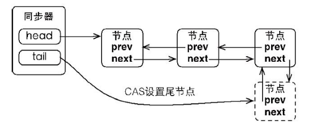
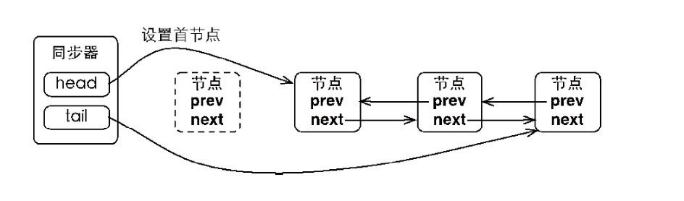

# 显示锁

Java 5 之前，在协调对共享对象的访问时可以使用的机制只有synchronized和volatile。Java 5 提供了显示锁机制，它提供了与synchronized关键字类似的同步功能，只是在使用时需要显示地获取和释放锁。虽然synchronized提供了便捷性的隐式获取锁释放锁机制（基于JVM机制），但是它却缺少了获取锁与释放锁的可操作性，可中断、超时获取锁。

## Lock接口

Lock的使用方法如下：

```java
Lock lock = new ReentrantLock();
lock.lock();

try {
    // do something
} finally {
    lock.unlock();
}
```

Lock接口提供的synchronized关键字不具备的主要特性

|特性|描述|
|---|---|
|尝试非阻塞地获取锁|当前线程尝试获取锁，如果这一时刻锁没有被其他线程获取到，则成功获取并持有锁|
|能被中断地获取锁|与synchronized不同，获取到锁地线程能够响应中断，当获取到锁的线程被中断时，中断异常将会被抛出，同时锁会被释放|
|超时获取锁|在指定的截止时间之前获取锁，如果截止时间到了仍旧无法获取锁，则返回|

### API

|方法|描述|
|---|---|
|void lock()|获取锁，调用该方法当前线程会获取锁，当锁获得后，从该方法返回|
|void lockInterruptibly() throws InterruptedException|可中断地获取锁，和lock()方法的不同之处在于该方法会响应中断，即在锁的获取中可以中断当前线程|
|boolean tryLock()|尝试非阻塞的获取锁，调用该方法后立即返回，如果能够获取到则返回true，否则返回false|
|boolean tryLock(long time, TimeUnit unit) throws InterruptedException|超时获取锁，当前线程在一下3种情况会返回：</br>1.当前线程在超时时间内获得了锁</br>2.当前线程在超时时间内被中断</br>3.超时时间结束，返回false|
|void unlock()|释放锁|
|Condition newCondition()|获取等待通知组件，该组件和当前的锁绑定，当前线程只有获得了锁，才能调用该组件的wait()方法，而调用后，当前线程将释放锁|

## 队列同步器(AQS)

队列同步器(AbstractQueuedSynchronizer, AQS)，是用来构建锁和其他同步组件的基础框架（如ReentrantLock、ReentrantReadWriteLock、Semaphore等），它使用了一个int成员变量表示同步状态，通过内置的FIFO队列来完成资源获取线程的排队工作。

AQS的主要使用方式是继承，子类通过继承AQS并实现它的抽象方法来管理同步状态。

### API

同步器使用一个int类型的成员变量来表示同步状态，当state>0时表示已经获得了锁，当state=0时表示释放了锁，重写同步器指定的方法时，__需要使用同步器提供如下三个(protected final)方法来访问或修改同步状态__：

|方法|描述|
|---|---|
|int getState()|获取当前同步状态|
|void setState(int newState)|设置当前同步状态|
|boolean compareAndSetState(int expect, int update)|使用CAS设置当前状态，该方法能够保证状态设置的原子性|

__同步器可以重写的方法(protected)：__

|方法|描述|
|---|---|
|boolean tryAcquire(int arg)|独占式获取同步状态，实现该方法需要查询当前状态并判断同步状态是否符合预期，然后再进行CAS设置同步状态|
|boolean tryRelease(int arg)|独占式释放同步状态，等待获取同步状态的线程将有机会获取同步状态|
|int tryAcquireShared(int arg)|共享式获取同步状态，返回大于等于0的值，表示获取获取成功，反之，获取失败|
|boolean tryReleaseShared(int arg)|共享式释放同步状态|
|boolean isHeldExclusively()|当前同步器是否在独占式模式下被线程占用，一般该方法表示是否被当前线程所独占|

__实现自定义同步组件时，将会调用同步器提供的模板方法(public final)：__

|方法|描述|
|---|---|
|void acquire(int arg)|独占式获取同步状态，如果当前线程获取同步状态成功，则由该方法返回，否则，将会进入同步队列等待，该方法将会调用可重写的tryAcquire(int arg)方法|
|void acquireInterruptibly(int arg) throws InterruptedException|与acquire(int arg)相同，但是该方法响应中断，当前线程为获取到同步状态而进入到同步队列中，如果当前线程被中断，则该方法会抛出InterruptedException异常并返回|
|boolean tryAcquireNanos(int arg, long nanosTimeout) throws InterruptedException|超时获取同步状态，如果当前线程在nanos时间内没有获取到同步状态，那么将会返回false，已经获取则返回true；|
|void acquireShared(int arg)|共享式获取同步状态，如果当前线程未获取到同步状态，将会进入同步队列等待，与独占式的主要区别是在同一时刻可以有多个线程获取到同步状态；|
|void acquireSharedInterruptibly(int arg) throws InterruptedException|共享式获取同步状态，响应中断|
|boolean tryAcquireSharedNanos(int arg, long nanosTimeout) throws InterruptedException|共享式获取同步状态，增加超时限制|
|boolean release(int arg)|独占式释放同步状态，该方法会在释放同步状态之后，将同步队列中第一个节点包含的线程唤醒；|
|boolean releaseShared(int arg)|共享式释放同步状态|
|Collection<Thread> getQueuedThreads()|获取等待在同步队列上的线程集合|

模板方法大概分为三类：

+ 独占式获取与释放同步状态
+ 共享式获取与释放同步状态
+ 查询同步队列中的等待线程情况

### CLH同步队列

同步器中维护着一个FIFO双向队列，来完成同步状态的管理。当前线程如果获取同步状态失败时，AQS则会将当前线程已经等待状态等信息构造成一个节点（Node）并将其加入到CLH同步队列队尾，同时会阻塞当前线程，当同步状态释放时，会把首节点唤醒，使其再次尝试获取同步状态。

同步队列中的结点(Node)用于保存获取同步状态失败的线程引用、等待状态以及前驱和后继结点：

```java


static final class Node {
    static final Node SHARED = new Node(); // 共享
    static final Node EXCLUSIVE = null; // 独占

    /** 该节点的线程可能由于超时或被中断而处于被取消(作废)状态,一旦处于这个状态,节点状态将一直处于CANCELLED(作废),因此应该从队列中移除 */
    static final int CANCELLED =  1;
    /** 当前节点为SIGNAL时,后继节点会被挂起,因此在当前节点释放锁或被取消之后必须被唤醒(unparking)其后继结点 */
    static final int SIGNAL    = -1;
    /** 该节点的线程处于等待条件状态,不会被当作是同步队列上的节点,直到被唤醒(signal),设置其值为0,重新进入阻塞状态 */
    static final int CONDITION = -2;
    /** 表示下一次共享式同步状态获取将会无条件地传播下去 */
    static final int PROPAGATE = -3;

    volatile int waitStatus; //等待状态
    volatile Node prev; //前驱结点
    volatile Node next; //后继结点
    volatile Thread thread; //获取同步状态的线程
    Node nextWaiter; //等待队列中的后继结点

    final boolean isShared() {
        return nextWaiter == SHARED;
    }

    final Node predecessor() throws NullPointerException {
        Node p = prev;
        if (p == null)
            throw new NullPointerException();
        else
            return p;
    }

    Node() {    // Used to establish initial head or SHARED marker
    }

    Node(Thread thread, Node mode) {     // Used by addWaiter
        this.nextWaiter = mode;
        this.thread = thread;
    }

    Node(Thread thread, int waitStatus) { // Used by Condition
        this.waitStatus = waitStatus;
        this.thread = thread;
    }
}
```

同步器拥有首结点(head)和尾结点(tail)，没有成功获取同步状态的线程将会成为结点加入该队列的尾部

```java
private transient volatile Node head;
private transient volatile Node tail;
private volatile int state;
```



同步队列遵循FIFO，首结点时获取同步状态成功的结点，首结点的线程在释放同步状态时，将会唤醒后继结点，而后继结点将会在获取同步状态成功时将自己设置为首结点。



### 同步状态获取和释放

