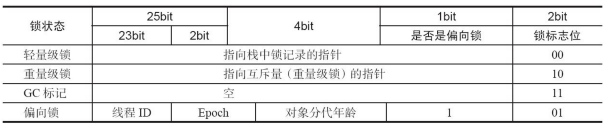

# synchronized与volatile

在讨论多线程并发编程时，总会讨论到原子性和内存可见性:

+ 原子性是指一个操作或者多个操作要么全部执行并且执行的过程不会被任何因素打断，要么全部不执行
+ 可见性是指当多个线程访问同一个变量时，一个线程修改了这个变量的值，其他线程能够立即看得到修改的值

__volatile提供了内存可见性，但是不具备原子性，synchronized能同时提供原子性和内存可见性的保证__。

## volatile

### 定义

__如果一个字段被声明成volatile，Java内存模型保证所有的线程看到这个变量是一致的__。

从Java内存模型的抽象结构去解释：每次读取volatile 变量时将从电脑的主内存中读取而不是从CPU缓存中读取，每次对一个 volatile 变量进行写操作时，将会写入到主内存中而不是写入到CPU缓存中。

### 实现原理

volatile的内存可见性是由[Java内存模型(JMM)](JMM.md)保证的，JMM的happen-before原则中的volatile规则保证了对volatile域的写入操作happens-before于每一个后续对同一个域的读写操作。JVM为实现volatile规则会通过插入内存屏障来禁止重排序。

### 使用场景

如果volatile变量使用恰当的话，它比synchronized的使用和执行成本更低，因为它不会引起线程上下文的切换和调度。

《Java并发编程实战》中提到，当且仅当满足以下条件时，才应该使用volatile变量：

+ 对变量的写入操作不一起变量的当前值，或者你能确保只有单个线程更新变量的值
+ 该变量不会与其他状态变量一起纳入不变性条件中
+ 在访问变量时不需要加锁

此外Brian Goetz还给出了几种正确使用volatile的模式： [正确使用 Volatile 变量](https://www.ibm.com/developerworks/cn/java/j-jtp06197.html)

## synchronized

synchronized 是最常使用的同步手段，主要有如下三种形式：

+ 对于普通同步方法，锁是当前实例对象
+ 对于静态同步方法，锁是当前类的Class对象
+ 对于同步代码块，锁是synchronized括号内配置的对象

对于synchronized 代码块，当Java源代码被javac编译成字节码的时候，会在同步块的入口位置和退出位置分别插入monitorenter和monitorexit字节码指令。对于同步方法，在编译生成的Class文件的方法表中会将该方法的access_flags字段中的synchronized标志位置1。

### Java对象头

synchronized 使用的锁是存在Java对象头中的。对象头主要包括两部分数据：

+ Mark Work（标记字段）： 存储对象的hashcode或者锁信息等
+ Klass Pointer（类型指针）： 类元数据的指针，虚拟机根据这个指针来确定这个对象是哪个类的实例
+ Array length（数组长度）： 如果当前对象是数组，会多4个字节来存储数组长度

Mark Word用于存储对象自身的运行时数据，如HashCode、GC分代年龄、锁状态标志、线程持有的锁、偏向线程 ID、偏向时间戳等等，在运行期间，Mark Word里存储的数据会随着锁标志位的变化而变化

## 参考资料

+ [正确使用 Volatile 变量，Brian Goetz](https://www.ibm.com/developerworks/cn/java/j-jtp06197.html)
+ [《Java并发编程的艺术》方腾飞,魏鹏,程晓明 著. ](https://www.amazon.cn/dp/B012NDCEA0/ref=sr_1_1?ie=UTF8&qid=1520002234&sr=8-1&keywords=Java%E5%B9%B6%E5%8F%91%E7%BC%96%E7%A8%8B%E7%9A%84%E8%89%BA%E6%9C%AF)
