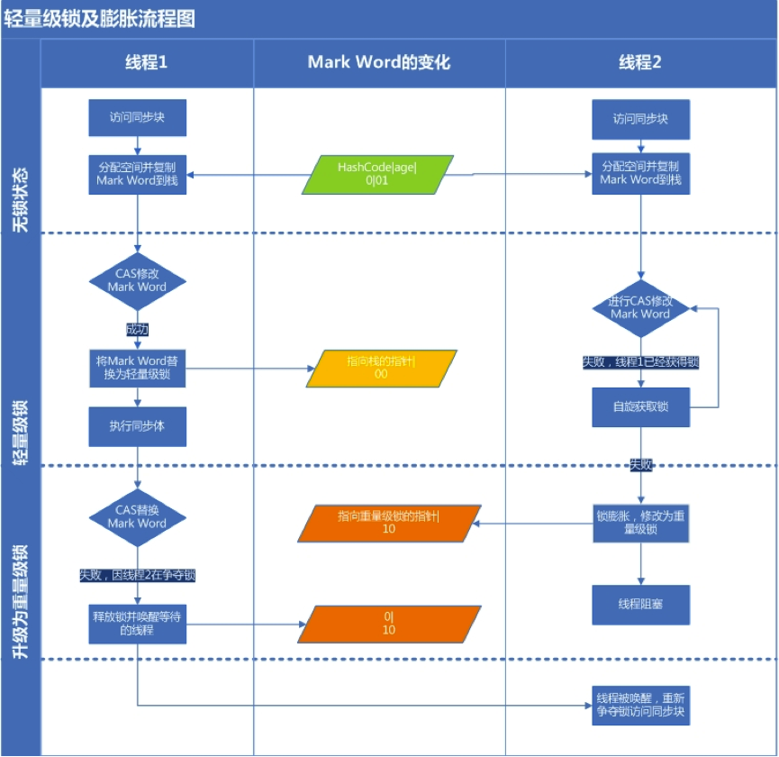

# synchronized与volatile

在讨论多线程并发编程时，总会讨论到原子性和内存可见性:

+ 原子性是指一个操作或者多个操作要么全部执行并且执行的过程不会被任何因素打断，要么全部不执行
+ 可见性是指当多个线程访问同一个变量时，一个线程修改了这个变量的值，其他线程能够立即看得到修改的值

__volatile提供了内存可见性，但是不具备原子性，synchronized能同时提供原子性和内存可见性的保证__。


## volatile

### 定义

__如果一个字段被声明成volatile，Java内存模型保证所有的线程看到这个变量是一致的__。

从Java内存模型的抽象结构去解释：每次读取volatile 变量时将从电脑的主内存中读取而不是从CPU缓存中读取，每次对一个 volatile 变量进行写操作时，将会写入到主内存中而不是写入到CPU缓存中。

### 实现原理

volatile的内存可见性是由[Java内存模型(JMM)](JMM.md)保证的，JMM的happen-before原则中的volatile规则保证了对volatile域的写入操作happens-before于每一个后续对同一个域的读写操作。JVM为实现volatile规则会通过插入内存屏障来禁止重排序。

### 使用场景

如果volatile变量使用恰当的话，它比synchronized的使用和执行成本更低，因为它不会引起线程上下文的切换和调度。

《Java并发编程实战》中提到，当且仅当满足以下条件时，才应该使用volatile变量：

+ 对变量的写入操作不依赖变量的当前值，或者你能确保只有单个线程更新变量的值
+ 该变量不会与其他状态变量一起纳入不变性条件中
+ 在访问变量时不需要加锁

此外Brian Goetz还给出了几种正确使用volatile的模式： [正确使用 Volatile 变量](https://www.ibm.com/developerworks/cn/java/j-jtp06197.html)

## synchronized

synchronized 是最常使用的同步手段，主要有如下三种形式：

+ 对于普通同步方法，锁是当前实例对象
+ 对于静态同步方法，锁是当前类的Class对象
+ 对于同步代码块，锁是synchronized括号内配置的对象

对于synchronized 代码块，当Java源代码被javac编译成字节码的时候，会在同步块的入口位置和退出位置分别插入monitorenter和monitorexit字节码指令。对于同步方法，在编译生成的Class文件的方法表中会将该方法的access_flags字段中的synchronized标志位置1。

### Java对象头

synchronized 使用的锁是存在Java对象头中的。对象头主要包括两部分数据：

+ Mark Work（标记字段）： 存储对象的hashcode或者锁信息等
+ Klass Pointer（类型指针）： 类元数据的指针，虚拟机根据这个指针来确定这个对象是哪个类的实例
+ Array length（数组长度）： 如果当前对象是数组，会多4个字节来存储数组长度

Mark Word用于存储对象自身的运行时数据，如HashCode、GC分代年龄、锁状态标志、线程持有的锁、偏向线程 ID、偏向时间戳等等，在运行期间，Mark Word里存储的数据会随着锁标志位的变化而变化


### Monitor

在JVM内部，无论是同步方法还是同步代码块，无论是ACC_SYNCHRONIZED还是monitorenter、monitorexit都是基于Monitor实现的。

在Java虚拟机(HotSpot)中，Monitor是基于C++实现的，主要数据结构如下：

```cpp
  ObjectMonitor() {
    _header       = NULL;
    _count        = 0;
    _waiters      = 0,
    _recursions   = 0;
    _object       = NULL;
    _owner        = NULL;
    _WaitSet      = NULL;
    _WaitSetLock  = 0 ;
    _Responsible  = NULL ;
    _succ         = NULL ;
    _cxq          = NULL ;
    FreeNext      = NULL ;
    _EntryList    = NULL ;
    _SpinFreq     = 0 ;
    _SpinClock    = 0 ;
    OwnerIsThread = 0 ;
    _previous_owner_tid = 0;
  }
```

__关键字段__

+ _owner: 指向持有ObjectMonitor对象的线程
+ _WaitSet: 存放处于wait状态的线程队列
+ _EntryList: 存放处于等待锁block状态的线程队列
+ _recursions: 锁的重入次数
+ _count：用来记录该线程获取锁的次数

[源码地址](http://hg.openjdk.java.net/jdk8/jdk8/hotspot/file/87ee5ee27509/src/share/vm/runtime/objectMonitor.hpp#l140)


关于Monitor的详细介绍，请参考[Moniter的实现原理](http://www.hollischuang.com/archives/2030)

### 锁升级与对比

Java SE1.6里锁(这里锁都是指synchronized，内置锁)一共有四种状态，无锁状态，偏向锁状态，轻量级锁状态和重量级锁状态，它会随着竞争情况逐渐升级。锁可以升级但不能降级，目的是为了提高获得锁和释放锁的效率。

```
无锁-->偏向锁-->轻量级锁-->重量级锁
```

#### 偏向锁

Java偏向锁(Biased Locking)是Java6引入的一项锁优化。顾名思义，它会偏向于第一个访问锁的线程，如果在运行过程中，同步锁只有一个线程访问，不存在多线程争用的情况，则线程是不需要触发同步的，这种情况下，就会给线程加一个偏向锁。

如果在运行过程中，遇到了其他线程抢占锁，则持有偏向锁的线程会被挂起，JVM会消除它身上的偏向锁，将锁恢复到标准的轻量级锁

__引入背景：__

大多数情况下锁不仅不存在多线程竞争，而且总是由同一线程多次获得，为了让线程获得锁的代价更低而引入了偏向锁，减少不必要的CAS操作。

__偏向锁加锁:__

1. 访问Mark Word中偏向锁的标识是否设置成1，锁标志位是否为01，确认为可偏向状态
2. 如果为可偏向状态，则测试线程ID是否指向当前线程，如果是，进入步骤5，否则进入步骤3
3. 如果线程ID并未指向当前线程，则通过CAS操作竞争锁。如果竞争成功，则将Mark Word中线程ID设置为当前线程ID，然后执行5；如果竞争失败，执行4
4. 如果CAS获取偏向锁失败，则表示有竞争。当到达全局安全点（safepoint）时获得偏向锁的线程被挂起，偏向锁升级为轻量级锁，然后被阻塞在安全点的线程继续往下执行同步代码。（撤销偏向锁的时候会导致stop the word）
5. 执行同步代码

__偏向锁释放（膨胀）:__

偏向锁只有遇到其他线程尝试竞争偏向锁时，持有偏向锁的线程才会释放锁，线程不会主动去释放偏向锁。偏向锁的撤销，需要等待全局安全点（在这个时间点上没有字节码正在执行），它会首先暂停拥有偏向锁的线程，判断锁对象是否处于被锁定状态，撤销偏向锁后恢复到未锁定（标志位为“01”）或轻量级锁（标志位为“00”）的状态。


#### 轻量级锁

轻量级锁是由偏向所升级来的，偏向锁运行在一个线程进入同步块的情况下，当第二个线程加入锁争用的时候，偏向锁就会升级为轻量级锁。

__引入背景：__

这种锁实现的背后基于这样一种假设，即在真实的情况下我们程序中的大部分同步代码一般都处于无锁竞争状态（即单线程执行环境），在无锁竞争的情况下完全可以避免调用操作系统层面的重量级互斥锁，取而代之的是在monitorenter和monitorexit中只需要依靠一条CAS原子指令就可以完成锁的获取及释放。当存在锁竞争的情况下，执行CAS指令失败的线程将调用操作系统互斥锁进入到阻塞状态，当锁被释放的时候被唤醒。

__轻量级锁加锁：__

1. 判断当前对象是否处于无锁状态（hashcode、0、01），若是，则JVM首先将在当前线程的栈帧中建立一个名为锁记录（Lock Record）的空间，用于存储锁对象目前的Mark Word的拷贝（官方把这份拷贝加了一个Displaced前缀，即Displaced Mark Word）；否则执行步骤（3）
2. JVM利用CAS操作尝试将对象的Mark Word替换为指向锁记录的指针，如果成功表示竞争到锁，则将锁标志位变成00（表示此对象处于轻量级锁状态），执行同步操作；如果失败则执行步骤（3）
3. 判断当前对象的Mark Word是否指向当前线程的栈帧，如果是则表示当前线程已经持有当前对象的锁(重入)，则直接执行同步代码块；否则只能说明该锁对象已经被其他线程抢占了，这时轻量级锁需要膨胀为重量级锁，锁标志位变成10，后面等待的线程将会进入阻塞状态


__轻量级锁释放：__

1. 取出在获取轻量级锁保存在Displaced Mark Word中的数据
2. 用CAS操作将取出的数据替换当前对象的Mark Word中，如果成功，则说明释放锁成功，否则执行（3）
3. 如果CAS操作替换失败，说明有其他线程尝试获取该锁，则需要在释放锁的同时需要唤醒被挂起的线程




#### 重量级锁

重量级锁是依赖于底层操作系统的Mutex Lock实现，操作系统实现线程之间的切换需要从用户态到内核态的切换，切换成本非常高。
#### 锁对比

|锁|优点|缺点|适用场景|
|---|---|---|---|
|偏向锁|加锁和解锁不需要额外的消耗，和执行非同步方法比仅存在纳秒级的差距。|如果线程间存在锁竞争，会带来额外的锁撤销的消耗。|适用于只有一个线程访问同步块场景|
|轻量级锁|竞争的线程不会阻塞，提高了程序的响应速度。|如果始终得不到锁竞争的线程使用自旋会消耗CPU。|追求响应时间。同步块执行速度非常快。|
|重量级锁|线程竞争不使用自旋，不会消耗CPU。|线程阻塞，响应时间缓慢|追求吞吐量。同步块执行速度较长。|

## 参考资料

+ [正确使用 Volatile 变量，Brian Goetz](https://www.ibm.com/developerworks/cn/java/j-jtp06197.html)
+ [《Java并发编程的艺术》方腾飞,魏鹏,程晓明 著. ](https://www.amazon.cn/dp/B012NDCEA0/ref=sr_1_1?ie=UTF8&qid=1520002234&sr=8-1&keywords=Java%E5%B9%B6%E5%8F%91%E7%BC%96%E7%A8%8B%E7%9A%84%E8%89%BA%E6%9C%AF)
+ [java中的锁 -- 偏向锁、轻量级锁、自旋锁、重量级锁](http://blog.csdn.net/zqz_zqz/article/details/70233767)
