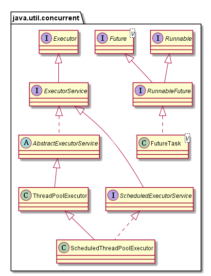
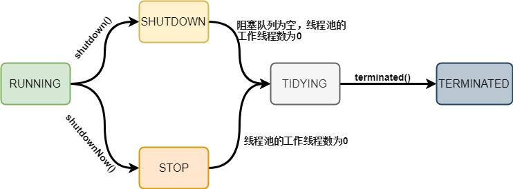

# 线程池

## Java 线程池

合理使用线程池的好处：

+ 降低资源消耗： 通过复用已创建的线程降低线程创建和销毁造成的消耗
+ 提高响应速度： 当任务到达时，不需要等到线程创建就能立即执行
+ 提高线程的可管理性： 线程是稀缺资源，如果无限制的创建，不仅会消耗系统资源，还会降低系统的稳定性，使用线程池可以进行统一的分配，调优和监控

### Executor 框架

在Java中，线程池功能由 Executor 框架提供，Executor 框架是一个根据一组执行策略调用，调度，执行和控制的异步任务的框架，目的是提供一种将”任务提交”与”任务如何运行”分离开来的机制。

Executor 框架主要包含三个部分：

+ 任务。包括被执行任务需要实现的接口： Runnable 或 Callable
+ 任务的执行。包括任务执行机制的核心接口：
    + Executor: 一个运行新任务的简单接口
    + ExecutorService: 扩展了 Executor，添加了一些管理执行器生命周期和任务执行周期的方法
    + ScheduledExecutorService： 扩展了ExecutorService。支持Future和定期执行任务
+ 异步计算的结果。包括接口 Future 和实现Future接口的FutureTask类



### 线程池(ThreadPoolExecutor)实现原理

Java 线程池主要流程：


#### 重要字段

```java
private final AtomicInteger ctl = new AtomicInteger(ctlOf(RUNNING, 0));
private static final int COUNT_BITS = Integer.SIZE - 3;
private static final int COUNT_MASK = (1 << COUNT_BITS) - 1;

// runState is stored in the high-order bits
private static final int RUNNING    = -1 << COUNT_BITS;
private static final int SHUTDOWN   =  0 << COUNT_BITS;
private static final int STOP       =  1 << COUNT_BITS;
private static final int TIDYING    =  2 << COUNT_BITS;
private static final int TERMINATED =  3 << COUNT_BITS;
```

ctl 是对线程池的运行状态和线程池中有效线程的数量进行控制的一个字段，包含了两部分信息：

+ 高3位： runState，线程的运行状态(RUNNING, SHUTDOWN, STOP, TIDYING, TERMINATED)
+ 低29位: workerCount， 线程池内有效线程数量

线程池的状态转换如图：



#### 构造参数

+ corePoolSize： 核心线程数量
+ maximumPoolSize：最大线程数量
+ workQueue： 等待队列，当任务提交时，如果线程池中的线程数量大于等于corePoolSize的时候，把该任务封装成一个Worker对象放入等待队列
+ threadFactory： 用来创建新线程
+ handler： 饱和策略，如果阻塞队列满了并且没有空闲的线程，这时如果继续提交任务，就需要采取一种策略处理该任务。包括
    + AbortPolicy: 直接抛出异常，默认策略
    + CallerRunsPolicy: 用调用者所在的线程来执行任务
    + DiscardOldestPolicy: 丢弃阻塞队列中靠最前的任务，并执行当前任务
    + DiscardPolicy：直接丢弃任务
+ keepAliveTime & unit： 线程池维护线程所允许的空闲时间

#### execute 方法

```java
public void execute(Runnable command) {
    if (command == null)
        throw new NullPointerException();

    int c = ctl.get();
    // 若当前活动线程数小于corePoolSize，则新建一个worker放入线程池中，并把任务添加到该worker中
    if (workerCountOf(c) < corePoolSize) {
        if (addWorker(command, true))
            return;
        c = ctl.get(); // 如果添加失败，则重新获取ctl的值
    }

    // 如果当前线程池是运行状态，且成功将任务添加到队列
    if (isRunning(c) && workQueue.offer(command)) {
        int recheck = ctl.get();
        // 再次判断线程的运行状态，如果不是运行状态，则将之前加入到workQueue的command删除
        if (! isRunning(recheck) && remove(command))
            reject(command); // 执行拒绝策略
        else if (workerCountOf(recheck) == 0)
            // 第一个参数为null，表示在线程池中创建一个线程，但不去启动；
            // 任务已经被添加到workQueue中了
            addWorker(null, false);
    }
    // 如果执行到这里，有两种情况：
    // 1. 线程池已经不是RUNNING状态；
    // 2. 线程池是RUNNING状态，但workerCount >= corePoolSize并且workQueue已满。
    // 这时，再次调用addWorker方法，但第二个参数传入为false，将线程池的有限线程数量的上限设置为maximumPoolSize；
    // 如果失败则拒绝该任务
    else if (!addWorker(command, false))
        reject(command);
}
```

## 参考资料

+ [深入理解 Java 线程池：ThreadPoolExecutor](https://juejin.im/entry/58fada5d570c350058d3aaad)