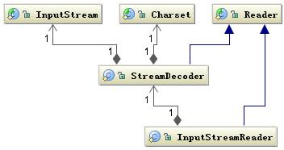

# Java I/O

## 基本架构

根据数据格式和传输方式，Java的I/O操作类大概分为如下四组：

+ 基于字节操作的I/O接口：InputStream和OutputStream
+ 基于字符操作的I/O接口：Writer和Reader
+ 基于磁盘操作的I/O接口：File
+ 基于网络操作的I/O接口：Socket

### 字节操作

__类图__

Java I/O使用了装饰器模式来实现。以InputStream为例，InputStream是抽象组件，FileInputStream是InputStream的子类，是具体组件，提供了字节流的输入操作。FilterInputStream是抽象装饰者，装饰者用于装饰组件，为组件提供额外的功能。

### 字符操作

不管是磁盘还是网络传输，最小的存储单元都是字节，而不是字符，所以 I/O 操作的都是字节而不是字符。但是在程序中操作的数据通常是字符形式，因此需要提供对字符进行操作的方法。

__类图__

Writer类提供公共抽象方法`write(char cbuf[], int off, int len)`

Reader类提供公共抽象方法`int read(char cbuf[], int off, int len)`

### 字符与字节转换

字节和字符的转换过程由InputStreamReader和OutputStreamWriter完成。InputStreamReader 实现从文本文件的字节流解码成字符流；OutputStreamWriter 实现字符流编码成为文本文件的字节流。它们都继承自 Reader 和 Writer。

__类图__

## 磁盘I/O

### File

文件是操作系统和磁盘驱动器交互的一个最小单元，Java中的File类可以用于表示文件和目录，但是它不代表一个真实存在的文件对象。
