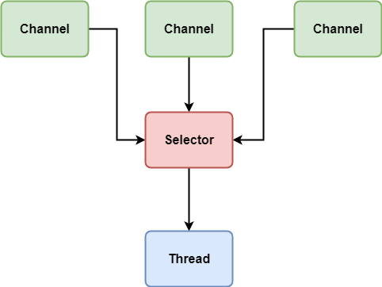

# NIO

## 概述

Java NIO 由以下几个核心部分组成：

+ Channels
+ Buffers
+ Selectors

NIO 基于 Channel 和 Buffer 进行操作，数据总是从通道读取到缓冲区，或者从缓冲区写入到通道。

Selector 允许单线程处理多个Channel

要使用Selector，得像Selector注册Channel，然后调用它得`select()`方法。这个方法会一直阻塞到某个注册得通道有事件就绪，一旦方法返回，线程就可以处理这些事件。

## Buffer

Java NIO中的Buffer用于和NIO通道进行交互。从Channel中读取数据到Buffer，或者从Buffer中把数据写入到Channel。缓冲区本质上是一块可以写入数据，然后可以从中读取数据的内存。这块内存被包装成NIO Buffer对象，并提供了一组方法，用来方便的访问该块内存。

### 基本用法

使用Buffer读写数据一般遵循以下几个步骤：

1. 初始化并分配空间
2. 写入数据到Buffer
3. 调用`flip()`方法切换到读模式
4. 从Buffer中读取数据
5. 调用`clear()`方法或者`compact()`方法，让Buffer可以再次被写入

### 重要属性

+ capacity: 固定容量
+ position:
    + 写模式： 表示当前写入到什么位置。(从读模式切换到写模式时会置0)
    + 读模式： 表示当前读取到什么位置。(从写模式切换到读模式时会置0)
+ limit:
    + 写模式： 表示最多能写入到什么位置。等于capacity
    + 读模式： 表示最多能读取到什么位置，当Buffer从写模式切换到读模式时，limit被置为已写得数据量，即position
+ mark: 用于记录当前position的前一个位置或默认是0

### 分类

+ ByteBuffer
+ MappedByteBuffer
+ CharBuffer
+ DoubleBuffer
+ FloatBuffer
+ IntBuffer
+ LongBuffer
+ ShortBuffer

这些Buffer涵盖了能通过I/O发送的基本数据类型。

## Channel

Java NIO的Channel(通道)类似流，但又有些不同:

+ Channel是双向的，可读可写，但流的读写通常是单向的
+ Channel可以异步的读写
+ Channel中的数据总是要先读到一个Buffer，或者总是要从一个Buffer中写入。

### Channel的实现

+ FileChannel：从文件中读写数据
+ DatagramChannel：通过UDP读写网络中的数据
+ SocketChannel：通过TCP读写网络中的数据
+ ServerSocketChannel：可以监听新进来的TCP连接，像Web服务器那样。对每一个新进来的连接都会创建一个SocketChannel。

### Scatter/Gather 分散/聚集

Scatter: 从一个Channel读取信息分散到N个缓存区(Buffer)中
Gather: 从N个Buffer里面内容按照顺序发送到一个Channel

scatter / gather经常用于需要将传输的数据分开处理的场合，例如传输一个由消息头和消息体组成的消息，你可能会将消息体和消息头分散到不同的buffer中，这样你可以方便的处理消息头和消息体。

Scattering Reads 在移动下一个buffer前，必须填满当前的buffer，这也意味着它不适用于动态消息(消息大小不固定)。换句话说，如果存在消息头和消息体，消息头必须完成填充（例如 128byte），Scattering Reads 才能正常工作。

## Selector

Selector 是 Java NIO 中能够检测一个到多个NIO通道，并能够知晓通道是否为诸如读写事件做好准备的组件。这样一个单独的线程可以管理多个Channel，从而管理多个网络连接。