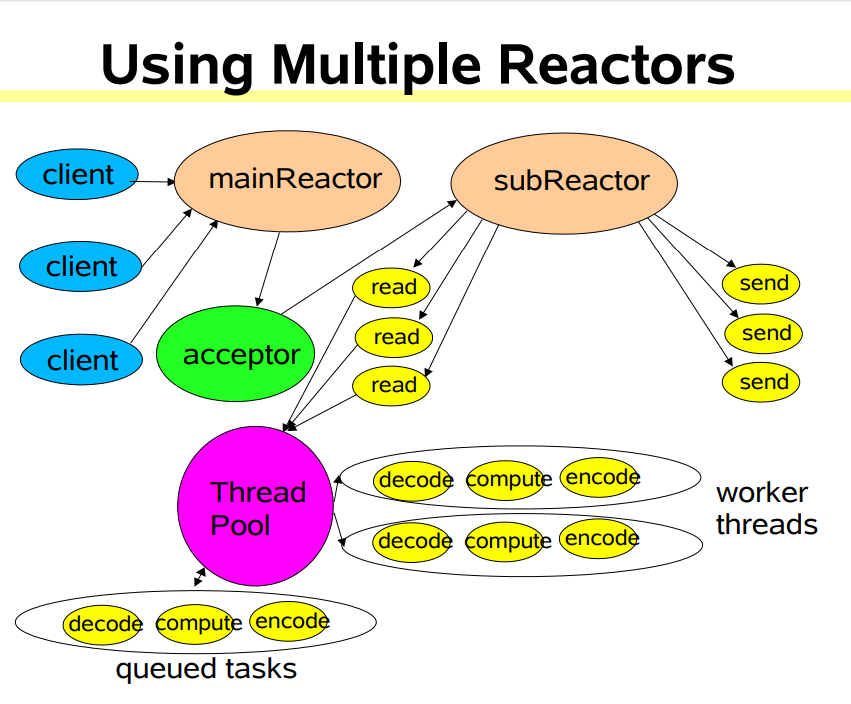

# NIO

## 概述

Java NIO 由以下几个核心部分组成：

+ Channels
+ Buffers
+ Selectors

NIO 基于 Channel 和 Buffer 进行操作，数据总是从通道读取到缓冲区，或者从缓冲区写入到通道。


Selector 允许单线程处理多个Channel


要使用Selector，得像Selector注册Channel，然后调用它得`select()`方法。这个方法会一直阻塞到某个注册得通道有事件就绪，一旦方法返回，线程就可以处理这些事件。

## Buffer

Java NIO中的Buffer用于和NIO通道进行交互。从Channel中读取数据到Buffer，或者从Buffer中把数据写入到Channel。缓冲区本质上是一块可以写入数据，然后可以从中读取数据的内存。这块内存被包装成NIO Buffer对象，并提供了一组方法，用来方便的访问该块内存。

### 基本用法

使用Buffer读写数据一般遵循以下几个步骤：

1. 初始化并分配空间
2. 写入数据到Buffer
3. 调用`flip()`方法切换到读模式
4. 从Buffer中读取数据
5. 调用`clear()`方法或者`compact()`方法，让Buffer可以再次被写入

### 重要属性

+ capacity: 固定容量
+ position:
    + 写模式： 表示当前写入到什么位置。(从读模式切换到写模式时会置0)
    + 读模式： 表示当前读取到什么位置。(从写模式切换到读模式时会置0)
+ limit:
    + 写模式： 表示最多能写入到什么位置。等于capacity
    + 读模式： 表示最多能读取到什么位置，当Buffer从写模式切换到读模式时，limit被置为已写得数据量，即position
+ mark: 用于记录当前position的前一个位置或默认是0

### 分类

+ ByteBuffer
+ MappedByteBuffer
+ CharBuffer
+ DoubleBuffer
+ FloatBuffer
+ IntBuffer
+ LongBuffer
+ ShortBuffer

这些Buffer涵盖了能通过I/O发送的基本数据类型。

## Channel

Java NIO的Channel(通道)类似流，但又有些不同:

+ Channel是双向的，可读可写，但流的读写通常是单向的
+ Channel可以异步的读写
+ Channel中的数据总是要先读到一个Buffer，或者总是要从一个Buffer中写入。

### Channel的实现

+ FileChannel：从文件中读写数据
+ DatagramChannel：通过UDP读写网络中的数据
+ SocketChannel：通过TCP读写网络中的数据
+ ServerSocketChannel：可以监听新进来的TCP连接，像Web服务器那样。对每一个新进来的连接都会创建一个SocketChannel。

### Scatter/Gather 分散/聚集

Scatter: 从一个Channel读取信息分散到N个缓存区(Buffer)中
Gather: 从N个Buffer里面内容按照顺序发送到一个Channel

scatter / gather经常用于需要将传输的数据分开处理的场合，例如传输一个由消息头和消息体组成的消息，你可能会将消息体和消息头分散到不同的buffer中，这样你可以方便的处理消息头和消息体。

Scattering Reads 在移动下一个buffer前，必须填满当前的buffer，这也意味着它不适用于动态消息(消息大小不固定)。换句话说，如果存在消息头和消息体，消息头必须完成填充（例如 128byte），Scattering Reads 才能正常工作。

## Selector

Selector 是 Java NIO 中能够检测一个到多个NIO通道，并能够知晓通道是否为诸如读写事件做好准备的组件。这样一个单独的线程可以管理多个Channel，从而管理多个网络连接。

### Selector 创建

通过调用`Selector.open()`方法创建一个Selector:

```java
Selector selector = Selector.open();
```

### 向Selector注册通道

为了将Channel和Selector配合使用，必须将channel注册到selector上。通过SelectableChannel.register()方法来实现:

```java
channel.configureBlocking(false);
SelectionKey key = channel.register(selector, Selectionkey.OP_READ);
```

与Selector一起使用时，Channel必须处于非阻塞模式下。这意味着不能将FileChannel与Selector一起使用，因为FileChannel不能切换到非阻塞模式。而套接字通道都可以。

register()方法的第二个参数。这是一个“interest集合”，意思是在通过Selector监听Channel时对什么事件感兴趣。可以监听四种不同类型的事件:

+ Connect
+ Accept
+ Read
+ Write

如果你对不止一种事件感兴趣，那么可以用“位或”操作符将常量连接起来:

```java
int interestSet = SelectionKey.OP_READ | SelectionKey.OP_WRITE;
```

### SelectionKey

当向Selector注册Channel时，register()方法会返回一个SelectionKey对象。SelectKey 封装了特定的 Channel 与特定的 Selector 的注册关系。SelectKey 对象主要包含下面的属性：

+ interest集合: 所选择的感兴趣的事件集合
+ ready集合: 通道已经准备就绪的操作的集合
+ Channel: 对应的Channel
+ Selector: 所注册的Selector

### 通过Selector选择就绪通道

一旦向Selector注册了一或多个通道，就可以调用几个重载的`select()`方法。这些方法返回你所感兴趣的事件（如连接、接受、读或写）已经准备就绪的那些通道

+ `int select()`: 阻塞到至少有一个通道在你注册的事件上就绪了
+ `int select(long timeout)`: 最长会阻塞timeout毫秒
+ `int selectNow()`: 不会阻塞，不管什么通道就绪都立刻返回

`select()`方法返回的int值表示有多少通道已经就绪，表示自上次调用`select()`方法后有多少通道变成就绪状态。

#### selectedKeys()

一旦调用了select()方法，并且返回值表明有一个或更多个通道就绪了，然后可以通过调用selector的selectedKeys()方法，访问“已选择键集（selected key set）”中的就绪通道。

随后可以遍历这个已选择的键集合来访问就绪的通道，并检测各个键所对应的通道的就绪事件。

注意每次迭代末尾的keyIterator.remove()调用。Selector不会自己从已选择键集中移除SelectionKey实例。必须在处理完通道时自己移除

#### wakeUp()

某个线程调用select()方法后阻塞了，即使没有通道已经就绪，也有办法让其从select()方法返回。只要让其它线程在第一个线程调用select()方法的那个对象上调用Selector.wakeup()方法即可。

#### close()

用完Selector后调用其close()方法会关闭该Selector，且使注册到该Selector上的所有SelectionKey实例无效。通道本身并不会关闭。

## Reactor

### 实现思想

在实践中，对于NIO和线程的使用，抽象成了一种Reactor模型。Reactor模型采用了分而治之和事件驱动的的思想：

+ 分而治之(Divide and Conquer)： 一个连接里完整的网络处理过程一般分为 accept，read，decode，process，encode，send这几步。而Reactor模式将每个步骤映射为 一个Task，服务端线程执行的最小逻辑单元不再是一个完整的网络请求，而是 Task，且采用非阻塞方式执行

+ 事件驱动(Event Driven)： 每个Task 对应特定的网络事件，当Task 准备就绪时，Reactor 收到对应的网络事件通知，并将Task 分发给绑定了对应网络事件的 Handler 执行

因此Reactor模式也叫做Dispatcher模式，即 I/O多路复用统一监听事件，收到事件后再分发(Dispatch)给相应的处理线程。

### Reactor角色

Reactor模式中的几个角色：

+ Reactor: 负责响应事件，将事件分发绑定了该事件的Handler处理
+ Handler: 事件处理器，负责非阻塞事件，Handler会将任务提交给业务逻辑线程池，处理具体业务

### Reactor模式的三种实现

Reactor与线程/线程池的组合可以有如下组合：

+ 单线程Reactor： 单个线程，所有连接注册到该线程上，适合I/O密集，不适合CPU密集（业务逻辑大量计算）的应用；CPU资源紧张使用单线程可以减少线程切换
+ Reactor与线程池： Reactor仅负责I/O，线程池负责其他业务逻辑
+ 双Reactor与线程池： mainReactor负责处理客户端的连接请求，并将accept的连接注册到subReactor的其中一个线程上；subReactor负责处理客户端通道上的数据读写和业务逻辑。

## 零拷贝

TODO



## 参考资料

+ [Netty 源码笔记](https://www.kancloud.cn/ssj234/netty-source/433211)
+ [Java NIO 系列教程](http://ifeve.com/java-nio-all/)
+ [Java NIO 系列文章之 浅析Reactor模式](https://juejin.im/post/5ba3845e6fb9a05cdd2d03c0)
+ [Scalable IO in Java](http://gee.cs.oswego.edu/dl/cpjslides/nio.pdf)