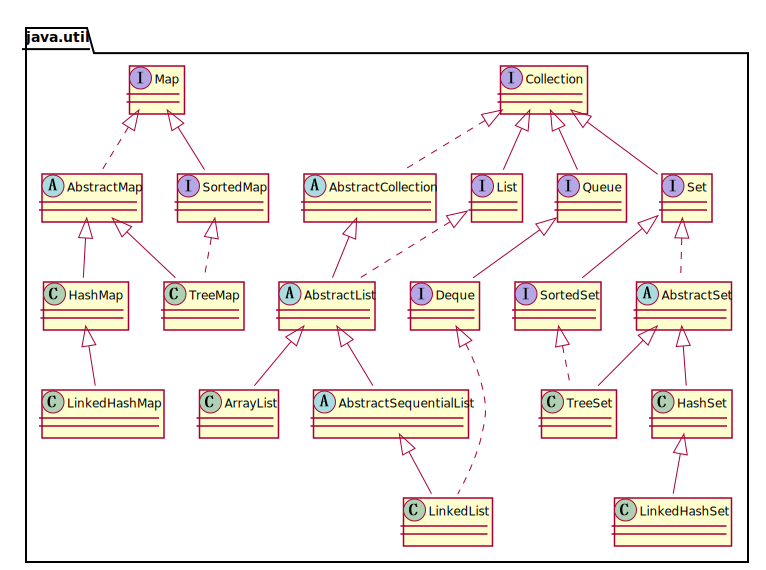

# Java集合框架

Java类库为保存对象提供一系列容器，也称为集合框架。Java集合包位于`java.util`包下，包含了很多常用的数据结构，如数组、链表、栈、队列、集合、哈希表等。

一般来讲，Java的集合框架主要包括三个部分：

+ `Collection`
+ `Map`
+ 工具类

`Collection` 接口是 `List`、`Set` 和 `Queue` 接口的父接口，抽象出了对"一堆对象"的公有操作。 `List` 通常表示一个列表，其中的元素允许重复。 `Set` 通常表示一个集合，接近数学中的"集合"概念，其中的元素不允许重复。`Queue` 通常表示一个队列，是一种特殊的线性表，它只允许在表的前端进行删除操作，而在表的后端进行插入操作。

`Map` 用于保存具有映射关系的数据。在Map中键可以是任意类型的对象，但不能有重复的键。

工具类主要包括用于遍历集合的迭代器，以及操作数组的Arrays和操作集合的Collections。

## 概览图

