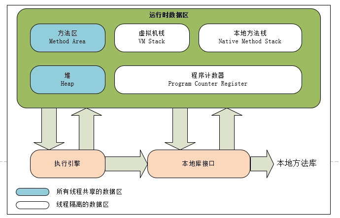

# JVM内存区域&内存溢出异常

## 运行时数据区域

JVM运行时会将其管理的内存划分为若干个数据区域（见图）：

### 程序计数器(Program Counter Register)

可理解为当前线程执行的字节码的行号指示器。

+ 线程私有
+ 未规定OOM(OutOfMemoryError)

### Java虚拟机栈(VM Stack)

描述Java方法执行的内存模型：每个方法在执行的同时都会创建一个栈帧(Stack Frame)，用于存储 `局部变量表`、`操作数栈`、`动态链接`、`方法出口`等信息。

__局部变量表__ 存放编译期可知的各种基本数据类型(`boolean, byte, char, short, int, float, long, double`)、对象引用(reference类型)和returnAddress类型。局部变量表所需的内存空间在编译期完成分配，当进入一个方法时，这个方法所需要在帧中分配多大的局部变量空间是完全确定的，在方法运行期间不会改变局部变量表的大小。

+ 线程私有
+ 可能抛出 StackOverFlowError 和 OOM

### 本地方法栈(Native Method Stack)

与Java虚拟机栈类似，只不过其描述的是本地方法的执行模型

+ 线程私有
+ 可能抛出 StackOverFlowError 和 OOM

*注* HotSpot将本地方法栈和虚拟机栈合二为一了

### Java堆(Java Heap)

Java堆是被所有线程共享的一块内存区域，在虚拟机启动时创建，用于存放对象实例。Java堆是垃圾收集器管理的主要区域，又称为`GC堆`。

由于现在收集器基本采用分代收集算法，Java堆可细分为：`新生代`和`老年代`；从内存分配角度来看，线程共享的Java堆中可能划分出多个线程私有的分配缓冲区(Thread Local Allocation Buffer, TLAB)。

+ 所有线程共享
+ 可能抛出 OOM
+ 大小可通过`-Xmx`和`-Xms`启动参数来控制

### 方法区(Method Area)

与Java堆一样，是各个线程共享的内存区域，用于存储已经被虚拟机加载的 `类信息`、`常量`、`静态变量`、`即时编译器编译后的代码`等数据。Java虚拟机规范把方法区描述为一个逻辑部分，不同虚拟机平台，以及不同的版本会有不同的实现。

JDK 7以前， HotSpot虚拟机使用永久代(`Permanent Generation`, Java堆的一部分)来实现方法区。JDK 8中永久代被删除，取而代之的是元空间(`MetaSpace`)， 与永久代不同的是，元空间直接使用本地内存而不是Java堆。

+ 可能抛出 OOM

### 运行时常量池(Runtime Constant Pool)

方法区一部分。运行时常量池除了包含Class文件所描述的常量池外，运行期间也可能将新的常量置入池中(String类的intern)。JDK6中位于永久代，JDK7位于堆，JDK8位于元空间。

+ 可能抛出 OOM

### 直接内存(Direct Memory)

直接内存并不是虚拟机运行时数据区的一部分，NIO可以使用Native函数库来直接分配直接内存。NIO基于通道与缓冲区，避免了在Java堆和Native堆中来回复制数据。

## 虚拟机对象

### 对象的创建

a). 首先检查new指令的参数是否能在常量池中定位到一个类的符号引用，并且检查这个符号引用代表的类是否已经被加载、解析和初始化过。如果没有，则必须先执行相应的类加载过程。

b). 类加载检查通过后，虚拟机将为新生成的对象分配内存。对象所需内存的大小在类加载完成后便可完全确定。分配策略主要有两种，指针碰撞和空闲列表。

（TODO 分配内存的并发处理 && TLAB）

c). 内存分配完成后，虚拟机需要将分配到的内存空间都初始化为零值(不包括对象头)，这一步操作保证了对象的实例字段在Java代码中可以不赋初值就直接使用，程序在使用这些对象的时候可以直接使用零值。

d). 接下来虚拟机将对对象进行必要的设置，进行这些设置的目的是可以知道这些对象是哪个类的实例、对象的哈希码、对象的GC分代年龄等信息，这些信息都存储在对象头中。

e). 从虚拟机角度讲，已经完成了对象的创建，接下来将执行`<init>`方法，把对象按照程序员的意愿进行初始化。

### 对象的内存布局

HotSpot虚拟机中，对象在内存中存储的布局可以分为3块区域：对象头(Header)，实例数据(Instance Data)和对齐填充(Padding)。

对象头又包括两部分信息，第一部分用于存储对象自身的运行时数据，比如哈希码、GC分代年龄、锁状态标志、线程持有锁、偏向线程ID、偏向时间戳等；对象头的另一部分是类型指针，即对象指向它的的类元数据的指针。如果对象是一个Java数组，那在对象头中还必须有一块用于记录数组长度的数据。

实例数据部分是对象真正存储的有效信息，也就是在程序代码中所定义的各种类型的字段内容。无论是从父类继承下来的，还是在子类中定义的，都需要记录起来。

对齐填充不是必然存在的，仅仅起占位符的作用。因为HotSpotVM规定对象的起始地址必须是8字节的整数倍。所以很有可能以上两部分的大小不够8字节的整数倍，那么这个字段就可以发挥作用了。

### 对象的访问定位

为了使用对象，Java程序需要通过栈中的`reference`数据来操作堆上的具体对象。通过这个`reference`数据只是一个指向对象的引用，对象的访问方式就可以不同。

目前主流的对象访问方式主要由句柄和直接指针两种。通过句柄访问的话，会在Java堆中划分出一块句柄池，句柄池中句柄存放了对象的实例数据和类型指针，而`reference`数据则存放了句柄的地址引用。使用直接指针访问对象，那么`reference`数据存放的就是对象的地址。

使用句柄访问的最大好处是`reference`中存储的稳定的句柄地址，当对象的地址发生了改变可以不用去关心。而直接指针的最大好处是速度更快，在于节省了一次指针定位的时间。HotSpot使用直接指针访问对象。
